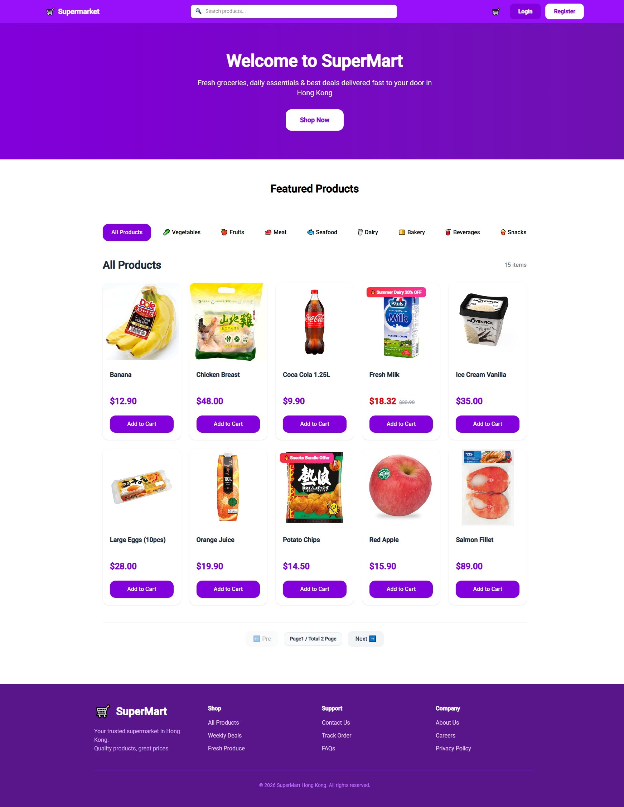
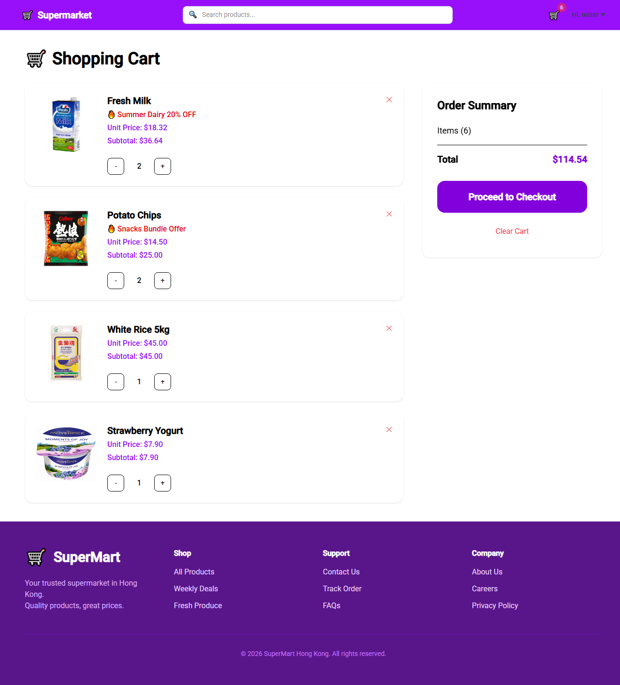
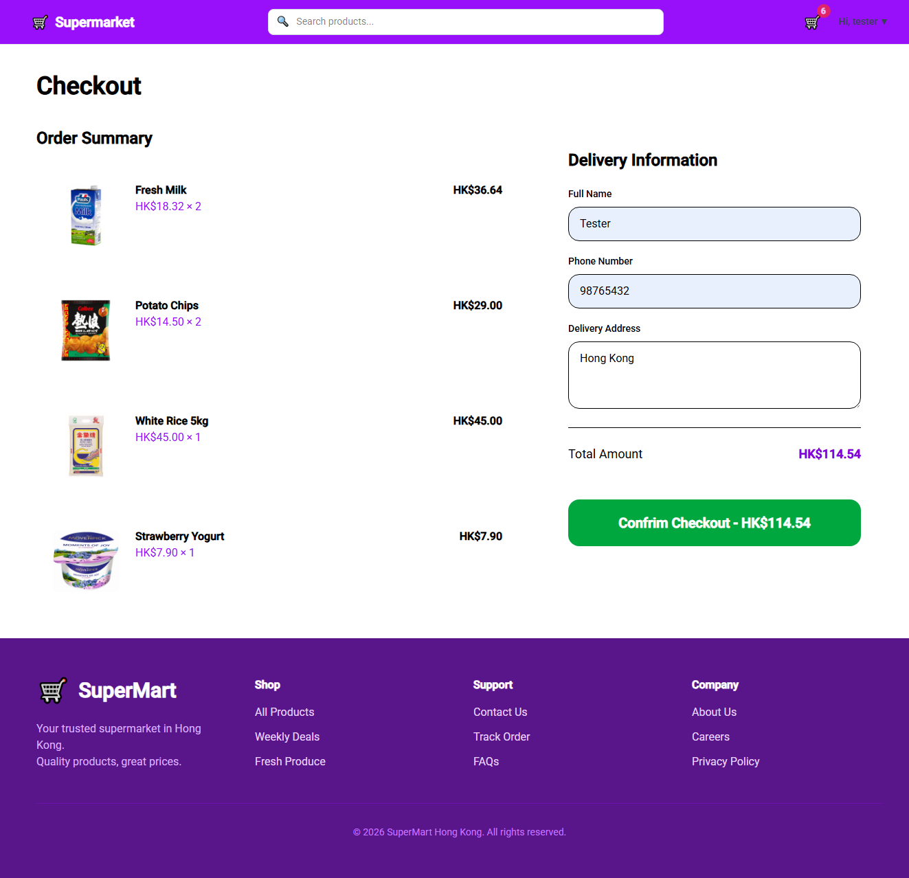
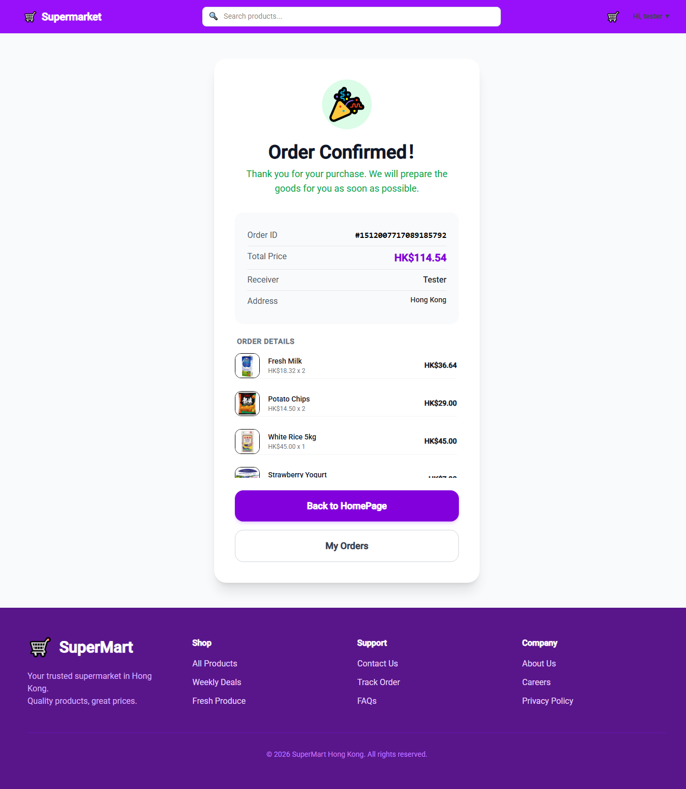
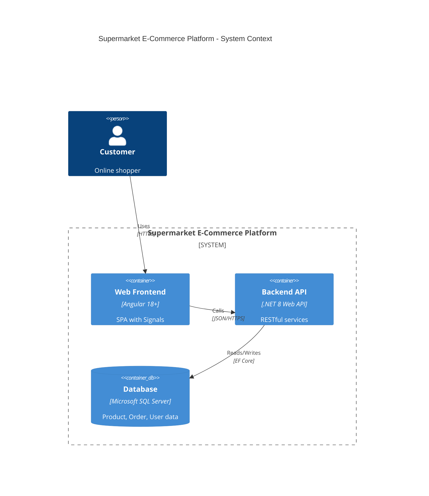

# 🛒 Supermarket E-Commerce Platform

**Full-Stack .NET 8 + Angular 18+** Online Shopping System

[](https://dotnet.microsoft.com)
[](https://angular.dev)
[](https://tailwindcss.com)

A production-like full-stack e-commerce platform built to demonstrate modern web development practices, clean architecture, and problem-solving skills.

---

## Key Features (Business & Tech Highlights)

- **User Authentication & Security**  
  JWT Authentication with **Refresh Token Rotation** to prevent replay attacks and support secure silent refresh.

- **Shopping Cart & Order Processing**  
  Real-time cart management with server-side pricing calculation and atomic order creation.

- **High Concurrency Handling**  
  Implemented **Pessimistic Locking** (UPDLOCK) with ordered product IDs to eliminate deadlocks during peak checkout scenarios.

- **Product Search & Discovery**  
  Server-side fuzzy search with autocomplete suggestions (limited to top 8 results) and category filtering.

- **Background Processing**  
  Integrated **Hangfire** for asynchronous tasks (e.g. order confirmation emails).
  
---

## Tech Stack & Engineering Standards

**Backend**  
- .NET 8 + ASP.NET Core Web API  
- Entity Framework Core (Code-First)  
- Microsoft SQL Server  
- Hangfire + IdGen (Snowflake ID)  

**Frontend**  
- Angular 18+ with Signals  
- RxJS + TypeScript  
- Tailwind CSS  

**Architecture & Quality**  
- Clean Architecture + RESTful Design  
- JWT Security  
- xUnit + Moq + EF Core InMemory Database for testing

---

## Project Structure

```text
.
├── supermarket-app/            # Angular Frontend Project
│   ├── src/
│   │   ├── app/
│   │   │   ├── components/     # Signal-driven UI Components (Products, Cart, Order)
│   │   │   ├── models/         # TypeScript Domain Models & Contract Interfaces
│   │   │   └── services/       # Cross-component Shared Services & RxJS API Pipes
│   │   └── ...
│   └── package.json            # Frontend script automation and ecosystem
│
└── SupermarketMock/            # ASP.NET Core Backend Project
    ├── Controllers/            # Thin REST Controllers decoupling routes from logic
    ├── DTOs/                   # Data Transfer Objects enforcing clean structural API schemas
    ├── Models/                 # EF Core Data Domain Entities
    ├── Services/               # Core Business Logic Layer (Fully decoupled)
    ├── appsettings.json        # Application configuration nodes (JWT Keys, DB Connections)
    └── Program.cs              # Global IoC Service Bootstrapper & Middleware Registry
```

---

## Screenshots

**Home Page + Productlist**


**Shopping Cart**


**Checkout Flow**



## Architecture Diagram



---

## Quality Assurance & Test-Driven Standards

-ProductService: Pagination, category filtering, autocomplete search

-OrderService: Promotion engine (Buy X Get Y), stock deduction, insufficient stock rollback

---

## Getting Started

### Backend Setup (.NET 8 Web API)

**Prerequisites**:
*   .NET 8 SDK
*   Microsoft SQL Server instance running locally

**Execution**:
1.  Navigate into the backend target folder:
    ```bash
    cd SupermarketMock
    ```
2.  Restore the required NuGet dependencies and configure your local SQL Server instance in `appsettings.json`:
 ```json
  {
    "ConnectionStrings": {
      "DefaultConnection": "Server=YOUR_SERVER_NAME;Database=SupermarketDB;Trusted_Connection=True;TrustServerCertificate=True;"
    },
    "Smtp": {
      "Host": "smtp.gmail.com",
      "Port": "587",
      "User": "your-email@gmail.com",
      "Password": "YOUR_APP_PASSWORD"
  }
}
```
*(Note: For Gmail, please use an App Password instead of your regular password.)*

3.  Execute the Entity Framework migration command:
    ```bash
    dotnet ef database update
    ```
4.  Launch the API engine:
    ```bash
    dotnet run
    ```
    The API gateway will host locally at `https://localhost:7154`.

### Frontend Setup (Angular)

**Prerequisites**:
*   Node.js (v18.x or above)
*   Angular CLI (`npm install -g @angular/cli`)

**Execution**:
1.  Navigate into the frontend target folder:
    ```bash
    cd supermarket-app
    ```
2.  Install the required npm dependencies:
    ```bash
    npm install
    ```
3.  Launch the local development server under SSL:
    ```bash
    ng serve --ssl
    ```
    The application will deploy at `https://localhost:4200`.

### Executing Automated Tests

1.  Navigate into the backend target folder:
    ```bash
    cd SupermarketMock.Tests
    ```
2.  Execute the full suite of automated backend service test specs
   ```bash
   dotnet test
   ```

Developed by Peter Kwok
Actively looking for Junior .NET Developer opportunities in Hong Kong.


