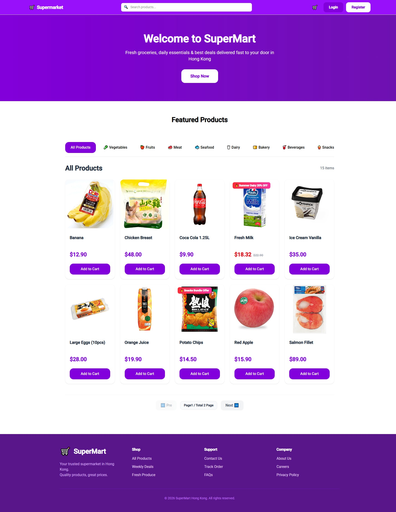
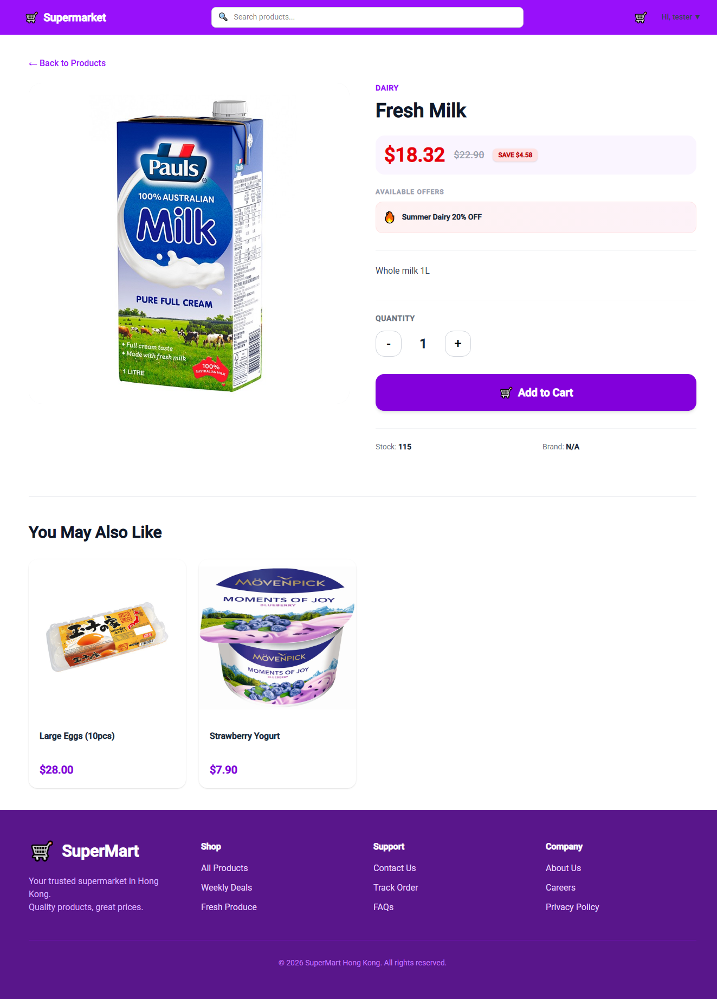
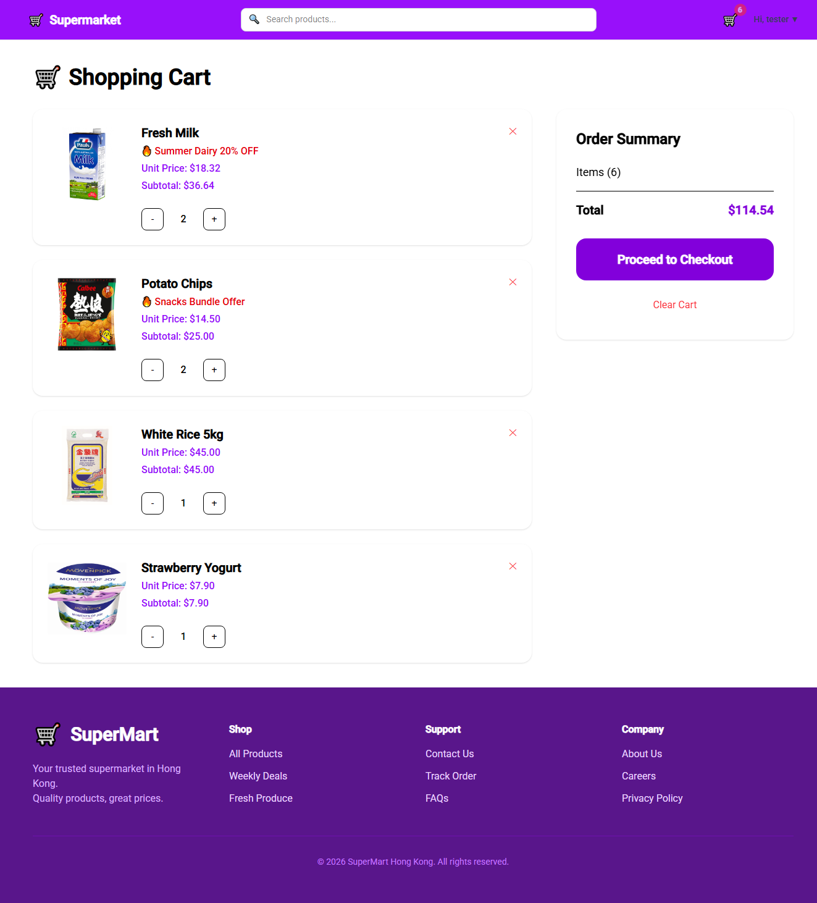
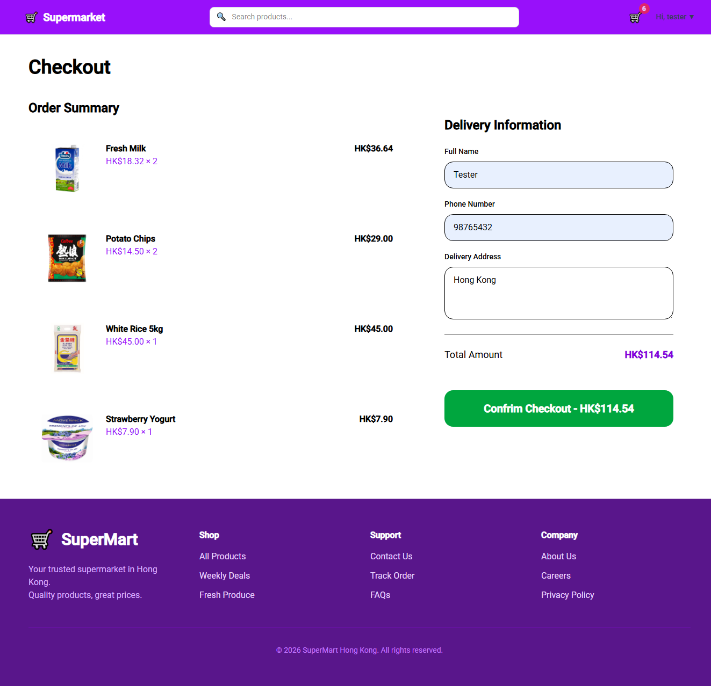
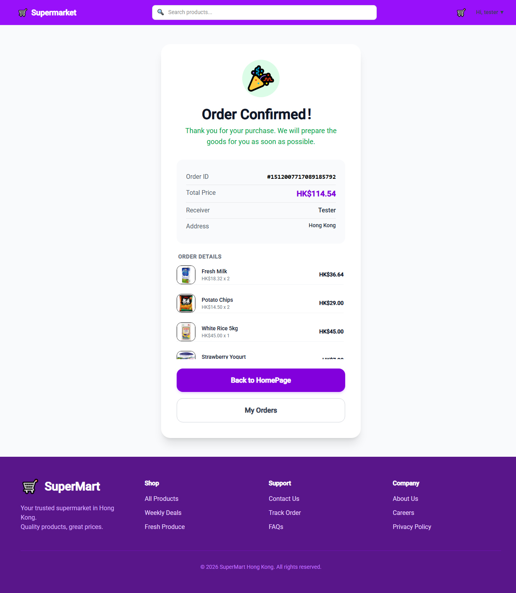
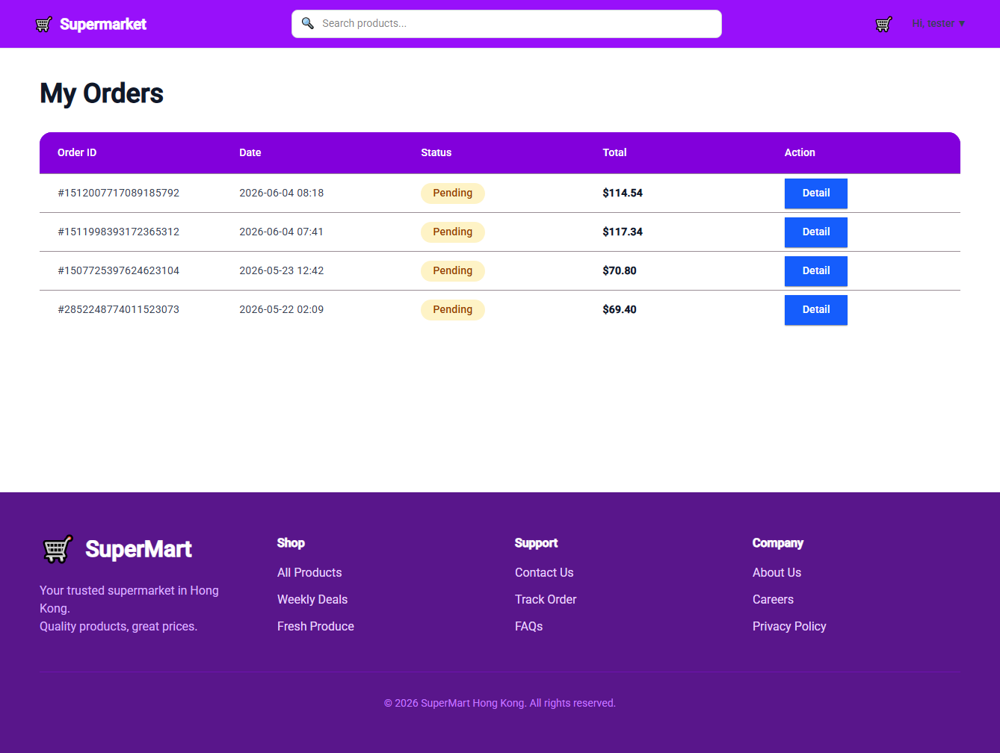
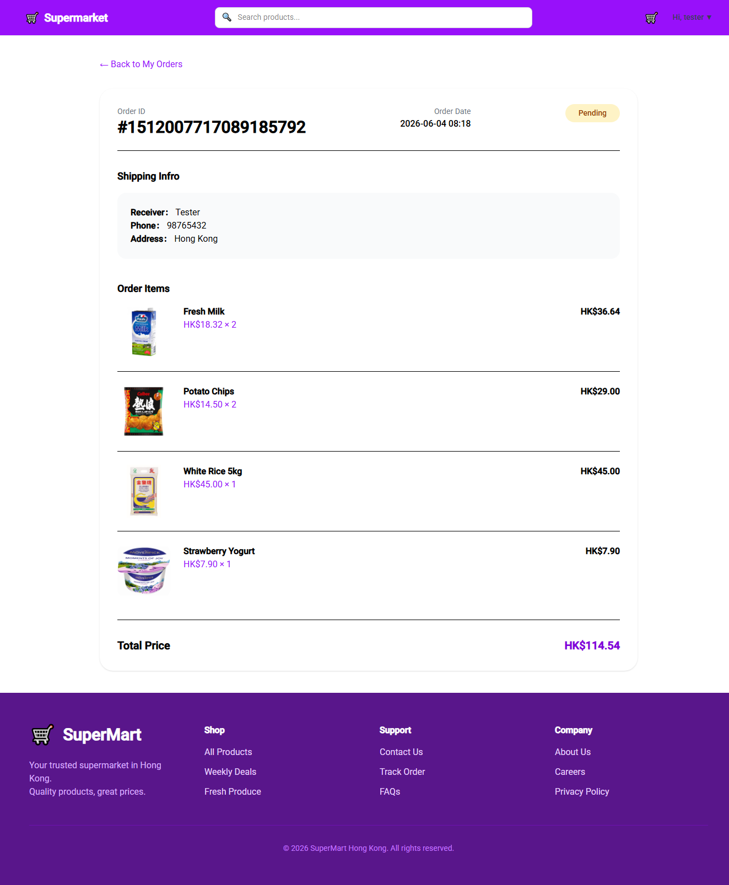
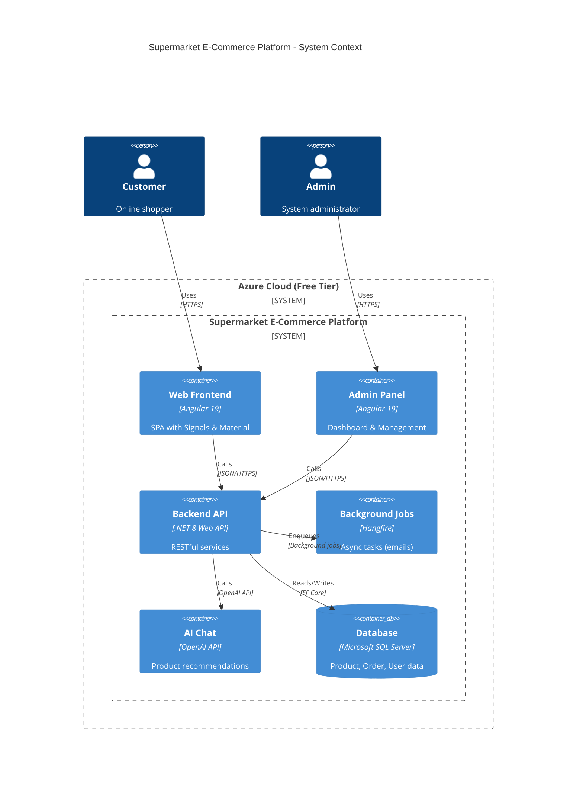

# 🛒 Supermarket E-Commerce Platform

**Production-Ready Full-Stack .NET 8 + Angular 19** E-Commerce System with Admin Dashboard

**Live Demo**: [https://api-supermarket-prod.azurewebsites.net/](https://api-supermarket-prod.azurewebsites.net/)

[](https://dotnet.microsoft.com)
[](https://angular.dev)
[](https://tailwindcss.com)
[](https://azure.microsoft.com)

A comprehensive full-stack e-commerce platform built to demonstrate modern development practices, clean architecture, and real-world problem-solving skills. Currently deployed on **Azure Free Tier**.

**Default Admin Login**: `admin@supermart.com` / `Admin123!`

---

## Key Highlights 

### Technical Strengths
- **High Concurrency Handling**: Implemented **Pessimistic Locking** (`UPDLOCK + ROWLOCK`) with ordered product IDs to prevent overselling during peak checkout.
- **Secure Authentication**: JWT with **Refresh Token Rotation** to prevent replay attacks and support secure silent refresh.
- **Background Processing**: Integrated **Hangfire** for reliable asynchronous tasks (order confirmation emails, etc.).
- **Admin Dashboard**: Real-time analytics with **Sales Trend Charts**, Low Stock Alerts, Top 10 Best Sellers, and Batch Operations.
- **AI Integration**: AI Chat Assistant for intelligent product recommendations and shopping guidance.
- **Cloud Deployment**: Fully deployed on **Azure App Service (Free Tier)** + SQL Database with CI/CD readiness.

### Admin Features
- Complete Product Management with **Batch Operations** (批量上下架 / 刪除)
- Low Stock Alert System with visual warnings
- Sales Trend Analysis using **ng2-charts**
- User Management, Order Management, Review Moderation, Coupon System

### Customer Features
- Smooth Shopping Cart & Checkout Flow
- Order History & Tracking
- Wishlist / Favorites
- Product Reviews & Ratings
- Coupon System
- Responsive UI with Tailwind CSS

---

## Tech Stack & Engineering Standards

### Backend
- .NET 8 + ASP.NET Core Web API
- Entity Framework Core (Code-First) with Soft Delete
- Microsoft SQL Server
- Hangfire + IdGen (Snowflake ID)
- JWT Bearer Authentication with Refresh Token Rotation
- FluentValidation + Global Exception Handling

### Frontend
- Angular 19 with Signals
- RxJS + TypeScript
- Tailwind CSS 4 + Angular Material
- Chart.js + ng2-charts (Dashboard)
- HTTP Interceptors + Route Guards

### Architecture & Quality
- **Clean Architecture** + Repository + Service Pattern
- Soft Delete pattern for data integrity
- Comprehensive Unit Testing (xUnit + Moq + EF InMemory)
- API Documentation with Swagger
- Deployed on Azure with production-like setup

---

## Project Structure

```text
.
├── supermarket-app/                    # Angular Frontend Project
│   ├── src/
│   │   ├── app/
│   │   │   ├── components/
│   │   │   │   ├── admin/            # Admin Dashboard Components
│   │   │   │   │   ├── dashboard/    # Analytics Dashboard (Sales Trends)
│   │   │   │   │   ├── products/     # Product Management
│   │   │   │   │   ├── product-modal/# Product Create/Edit Modal
│   │   │   │   │   ├── users/        # User Management
│   │   │   │   │   ├── orders/       # Order Management
│   │   │   │   │   ├── coupons/      # Coupon Management
│   │   │   │   │   ├── reviews/      # Review Moderation
│   │   │   │   │   ├── statusupdate-modal/ # Order Status Update Modal
│   │   │   │   │   └── layout/       # Admin Layout
│   │   │   │   ├── auth/             # Authentication (Login/Register)
│   │   │   │   ├── banner/           # Home Page Banner
│   │   │   │   ├── cart/             # Shopping Cart
│   │   │   │   ├── checkout/         # Checkout Flow
│   │   │   │   ├── coupons/          # Customer Coupon Page
│   │   │   │   ├── footer/           # Footer Component
│   │   │   │   ├── header/           # Navigation Header
│   │   │   │   ├── home/             # Home Page
│   │   │   │   ├── orders/           # Order History
│   │   │   │   ├── order-detail/     # Order Details
│   │   │   │   ├── order-success/    # Order Success Page
│   │   │   │   ├── product-detail/   # Product Details (Reviews)
│   │   │   │   ├── productlist/      # Product Listing
│   │   │   │   ├── profile/          # User Profile
│   │   │   │   ├── wishlist/         # Wishlist / Favorites
│   │   │   │   └── common/           # Shared UI Components
│   │   │   ├── guards/               # Route Guards (Auth, Admin, Guest)
│   │   │   ├── interceptors/         # HTTP Interceptors (JWT)
│   │   │   ├── models/               # TypeScript Domain Models
│   │   │   ├── pipes/                # Custom Pipes
│   │   │   ├── services/             # API Services
│   │   │   └── shared/               # Shared Utilities
│   │   └── ...
│   └── package.json
│
├── SupermarketMock/                    # ASP.NET Core Backend Project
│   ├── SupermarketMock/
│   │   ├── Controllers/              # REST API Controllers
│   │   ├── DTOs/                     # Data Transfer Objects
│   │   ├── IServices/                # Service Interfaces
│   │   ├── Models/                   # EF Core Entities
│   │   ├── Services/                 # Business Logic
│   │   ├── Middleware/               # Global Exception Middleware
│   │   ├── Migrations/               # Database Migrations
│   │   ├── Program.cs                # Application Entry Point
│   │   └── appsettings.json          # Configuration
│   └── SupermarketMock.sln
│
├── SupermarketMock.Tests/             # Unit Test Project
│   ├── ProductServiceTests.cs
│   ├── OrderServiceTests.cs
│   └── UnitTest1.cs
│
├── docs/                              # Documentation
│   └── ai-prompts.md
│
└── screenshots/                       # Application Screenshots
    ├── HomePage.jpg
    ├── ShoppingCart.jpg
    ├── Checkout.jpg
    ├── OrderSuccess.jpg
    ├── OrderDetail.jpg
    ├── MyOrders.jpg
    └── ProductDetail.jpg
```

---

## Screenshots

### Customer Interface
**Home Page + Product List**


**Product Detail**


**Shopping Cart**


**Checkout Flow**



**Order Management**



---

## Architecture Diagram


```mermaid
C4Context
    title Supermarket E-Commerce Platform - System Context

    Person(customer, "Customer", "Online shopper")
    Person(admin, "Admin", "System administrator")
    
    System_Boundary(azure, "Azure Cloud (Free Tier)") {
        System_Boundary(supermarket, "Supermarket E-Commerce Platform") {
            Container(frontend, "Web Frontend", "Angular 19", "SPA with Signals & Material")
            Container(admin_panel, "Admin Panel", "Angular 19", "Dashboard & Management")
            Container(api, "Backend API", ".NET 8 Web API", "RESTful services")
            Container(hangfire, "Background Jobs", "Hangfire", "Async tasks (emails)")
            Container(ai_chat, "AI Chat", "OpenAI API", "Product recommendations")
            ContainerDb(database, "Database", "Microsoft SQL Server", "Product, Order, User data")
        }
    }

    Rel(customer, frontend, "Uses", "HTTPS")
    Rel(admin, admin_panel, "Uses", "HTTPS")
    Rel(frontend, api, "Calls", "JSON/HTTPS")
    Rel(admin_panel, api, "Calls", "JSON/HTTPS")
    Rel(api, database, "Reads/Writes", "EF Core")
    Rel(api, hangfire, "Enqueues", "Background jobs")
    Rel(api, ai_chat, "Calls", "OpenAI API")
```

---

## Quality Assurance & Test-Driven Standards

### Test Coverage
- **ProductService**: Pagination, category filtering, autocomplete search, low stock alerts
- **OrderService**: Promotion engine (Buy X Get Y), stock deduction, insufficient stock rollback
- **AdminService**: User management, dashboard analytics
- **ReviewService**: Review submission, moderation, helpful votes
- **CouponService**: Coupon claim, validation, usage tracking
- **WishlistService**: Add/remove/list wishlist items

### Testing Stack
- xUnit — Test framework
- Moq — Mocking framework
- EF Core InMemory Database — In-memory database for testing

---

## Getting Started

### Backend Setup (.NET 8 Web API)

**Prerequisites**:
*   .NET 8 SDK
*   Microsoft SQL Server instance running locally

**Execution**:
1.  Navigate into the backend target folder:
    ```bash
    cd SupermarketMock
    ```
2.  Restore the required NuGet dependencies and configure your local SQL Server instance in `appsettings.json`:
 ```json
  {
    "ConnectionStrings": {
      "DefaultConnection": "Server=YOUR_SERVER_NAME;Database=SupermarketDB;Trusted_Connection=True;TrustServerCertificate=True;"
    },
    "Smtp": {
      "Host": "smtp.gmail.com",
      "Port": "587",
      "User": "your-email@gmail.com",
      "Password": "YOUR_APP_PASSWORD"
    }
  }
  ```
*(Note: For Gmail, please use an App Password instead of your regular password.)*

3.  Execute the Entity Framework migration command:
    ```bash
    dotnet ef database update
    ```
4.  Launch the API engine:
    ```bash
    dotnet run
    ```
    The API gateway will host locally at `https://localhost:7154`.
    
    **API Documentation**: Access Swagger UI at `https://localhost:7154/swagger`

### Frontend Setup (Angular)

**Prerequisites**:
*   Node.js (v18.x or above)
*   Angular CLI (`npm install -g @angular/cli`)

**Execution**:
1.  Navigate into the frontend target folder:
    ```bash
    cd supermarket-app
    ```
2.  Install the required npm dependencies:
    ```bash
    npm install
    ```
3.  Launch the local development server under SSL:
    ```bash
    ng serve --ssl
    ```
    The application will deploy at `https://localhost:4200`.

### Executing Automated Tests

1.  Navigate into the backend target folder:
    ```bash
    cd SupermarketMock.Tests
    ```
2.  Execute the full suite of automated backend service test specs
   ```bash
   dotnet test
   ```

---

## API Endpoints Overview

### Authentication
- `POST /api/auth/login` - User login
- `POST /api/auth/register` - User registration
- `POST /api/auth/refresh` - Refresh JWT token

### Products
- `GET /api/products` - List products with pagination/search
- `GET /api/products/{id}` - Get product details
- `GET /api/products/search` - Search products with autocomplete
- `POST /api/products/upload` - Upload product image (Admin)

### Cart & Orders
- `POST /api/cart` - Add to cart
- `GET /api/cart` - Get cart items
- `POST /api/orders` - Create order
- `GET /api/orders` - Get order history
- `GET /api/orders/{id}` - Get order details

### Reviews
- `GET /api/reviews/product/{productId}` - Get product reviews
- `POST /api/reviews` - Submit a review
- `POST /api/reviews/{id}/helpful` - Toggle helpful vote

### Coupons
- `GET /api/coupons/available` - List available coupons
- `POST /api/coupons/{id}/claim` - Claim a coupon
- `POST /api/coupons/validate` - Validate coupon at checkout

### Wishlist
- `GET /api/wishlist` - Get wishlist items
- `POST /api/wishlist/{productId}` - Add to wishlist
- `DELETE /api/wishlist/{productId}` - Remove from wishlist

### AI Chat
- `POST /api/chat` - Chat with AI assistant for product recommendations

### Admin - Dashboard
- `GET /api/admin/dashboard` - Dashboard statistics
- `GET /api/admin/dashboard/sales-trend` - Sales trend data
- `GET /api/admin/dashboard/top-selling` - Top selling products
- `GET /api/admin/alerts/low-stock` - Low stock alerts

### Admin - User Management
- `GET /api/admin/users` - List users
- `POST /api/admin/users` - Create user
- `PUT /api/admin/users/{id}` - Update user
- `DELETE /api/admin/users/{id}` - Delete user

### Admin - Product Management
- `GET /api/admin/products` - List all products (admin view)
- `POST /api/admin/products` - Create product
- `PUT /api/admin/products/{id}` - Update product
- `DELETE /api/admin/products/{id}` - Delete product
- `POST /api/admin/products/batch` - Batch operations
- `POST /api/admin/products/import` - Import products from Excel

### Admin - Order Management
- `GET /api/admin/orders` - List all orders
- `PUT /api/admin/orders/{id}/status` - Update order status

### Admin - Review Moderation
- `GET /api/admin/reviews` - List all reviews
- `PUT /api/admin/reviews/{id}/status` - Approve/reject review

### Admin - Coupon Management
- `GET /api/admin/coupons` - List all coupons
- `POST /api/admin/coupons` - Create coupon
- `PUT /api/admin/coupons/{id}` - Update coupon
- `DELETE /api/admin/coupons/{id}` - Delete coupon

### Health Check
- `GET /health` - Application health status (includes SQL Server check)

---

## Contributing

1. Fork the repository
2. Create your feature branch (`git checkout -b feature/AmazingFeature`)
3. Commit your changes (`git commit -m 'Add some AmazingFeature'`)
4. Push to the branch (`git push origin feature/AmazingFeature`)
5. Open a Pull Request

---

## License

This project is licensed under the MIT License - see the [LICENSE](LICENSE) file for details.

---

Developed by Peter Kwok  
Actively looking for Junior .NET Developer opportunities in Hong Kong.
