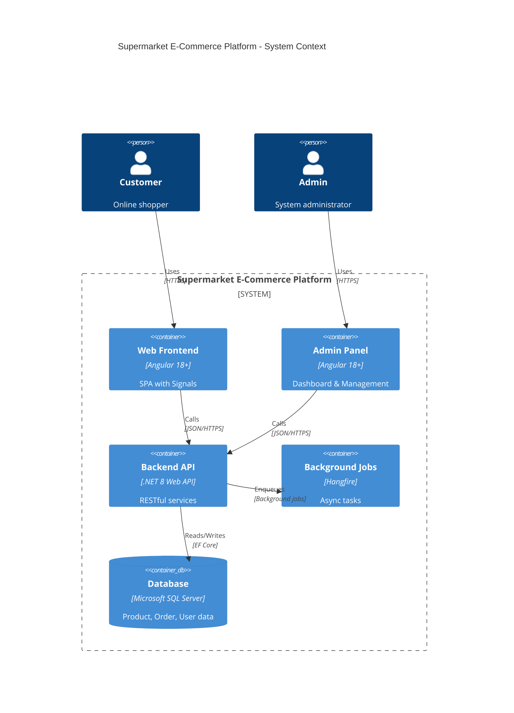

# 🛒 Supermarket E-Commerce Platform

**Full-Stack .NET 8 + Angular 18+** Online Shopping System with Admin Dashboard

[](https://dotnet.microsoft.com)
[](https://angular.dev)
[](https://tailwindcss.com)

A production-like full-stack e-commerce platform built to demonstrate modern web development practices, clean architecture, and problem-solving skills.

---

## Key Features

### Customer Features
- **User Authentication & Security**  
  JWT Authentication with **Refresh Token Rotation** to prevent replay attacks and support secure silent refresh.

- **Shopping Cart & Order Processing**  
  Real-time cart management with server-side pricing calculation and atomic order creation.

- **High Concurrency Handling**  
  Implemented **Pessimistic Locking** (UPDLOCK) with ordered product IDs to eliminate deadlocks during peak checkout scenarios.

- **Product Search & Discovery**  
  Server-side fuzzy search with autocomplete suggestions (limited to top 8 results) and category filtering.

- **Background Processing**  
  Integrated **Hangfire** for asynchronous tasks (e.g. order confirmation emails).

- **Order Tracking**  
  Full order history with detailed order information and status tracking.

### Admin Features
- **Admin Dashboard**  
  Comprehensive analytics with sales trends, low stock alerts, and key performance indicators.

- **User Management**  
  Full CRUD operations for user accounts with role-based access control.

- **Product Management**  
  Batch operations for products, inventory management, and low stock alerts.

- **Order Management**  
  View and manage customer orders with status updates.

---

## Tech Stack & Engineering Standards

### Backend
- .NET 8 + ASP.NET Core Web API
- Entity Framework Core (Code-First)
- Microsoft SQL Server
- Hangfire + IdGen (Snowflake ID)
- JWT Bearer Authentication
- Swagger/OpenAPI Documentation

### Frontend
- Angular 18+ with Signals
- RxJS + TypeScript
- Tailwind CSS
- Angular Guards (Auth/Admin)
- HTTP Interceptors
- Custom Pipes

### Architecture & Quality
- Clean Architecture + RESTful Design
- Interface Segregation (IServices/)
- JWT Security with Refresh Tokens
- Role-Based Authorization
- xUnit + Moq + EF Core InMemory Database for testing

---

## Project Structure

```text
.
├── supermarket-app/                    # Angular Frontend Project
│   ├── src/
│   │   ├── app/
│   │   │   ├── components/
│   │   │   │   ├── admin/            # Admin Dashboard Components
│   │   │   │   │   ├── dashboard/    # Analytics Dashboard
│   │   │   │   │   ├── products/     # Product Management
│   │   │   │   │   ├── users/        # User Management
│   │   │   │   │   └── layout/       # Admin Layout
│   │   │   │   ├── auth/             # Authentication Components
│   │   │   │   ├── cart/             # Shopping Cart
│   │   │   │   ├── checkout/         # Checkout Flow
│   │   │   │   ├── home/             # Home Page
│   │   │   │   ├── orders/           # Order History
│   │   │   │   ├── order-detail/     # Order Details
│   │   │   │   ├── product-detail/   # Product Details
│   │   │   │   ├── productlist/      # Product Listing
│   │   │   │   └── profile/          # User Profile
│   │   │   ├── guards/               # Route Guards (Auth, Admin, Guest)
│   │   │   ├── interceptors/         # HTTP Interceptors
│   │   │   ├── models/               # TypeScript Domain Models
│   │   │   ├── pipes/                # Custom Pipes
│   │   │   ├── services/             # API Services
│   │   │   └── shared/               # Shared Components
│   │   └── ...
│   └── package.json
│
├── SupermarketMock/                    # ASP.NET Core Backend Project
│   ├── SupermarketMock/
│   │   ├── Controllers/              # REST API Controllers
│   │   ├── DTOs/                     # Data Transfer Objects
│   │   ├── IServices/                # Service Interfaces
│   │   ├── Models/                   # EF Core Entities
│   │   ├── Services/                 # Business Logic
│   │   ├── Migrations/               # Database Migrations
│   │   ├── Program.cs                # Application Entry Point
│   │   └── appsettings.json          # Configuration
│   └── SupermarketMock.sln
│
├── SupermarketMock.Tests/             # Unit Test Project
│   ├── ProductServiceTests.cs
│   ├── OrderServiceTests.cs
│   └── UnitTest1.cs
│
├── docs/                              # Documentation
│   └── ai-prompts.md
│
└── screenshots/                       # Application Screenshots
    ├── HomePage.jpg
    ├── ShoppingCart.jpg
    ├── Checkout.jpg
    ├── OrderSuccess.jpg
    ├── OrderDetail.jpg
    ├── MyOrders.jpg
    └── ProductDetail.jpg
```

---

## Screenshots

### Customer Interface
**Home Page + Product List**


**Product Detail**


**Shopping Cart**


**Checkout Flow**


**Order Management**


---

## Architecture Diagram


```mermaid
C4Context
    title Supermarket E-Commerce Platform - System Context

    Person(customer, "Customer", "Online shopper")
    Person(admin, "Admin", "System administrator")
    
    System_Boundary(supermarket, "Supermarket E-Commerce Platform") {
        Container(frontend, "Web Frontend", "Angular 18+", "SPA with Signals")
        Container(admin_panel, "Admin Panel", "Angular 18+", "Dashboard & Management")
        Container(api, "Backend API", ".NET 8 Web API", "RESTful services")
        Container(hangfire, "Background Jobs", "Hangfire", "Async tasks")
        ContainerDb(database, "Database", "Microsoft SQL Server", "Product, Order, User data")
    }

    Rel(customer, frontend, "Uses", "HTTPS")
    Rel(admin, admin_panel, "Uses", "HTTPS")
    Rel(frontend, api, "Calls", "JSON/HTTPS")
    Rel(admin_panel, api, "Calls", "JSON/HTTPS")
    Rel(api, database, "Reads/Writes", "EF Core")
    Rel(api, hangfire, "Enqueues", "Background jobs")
```

---

## Quality Assurance & Test-Driven Standards

### Test Coverage
- **ProductService**: Pagination, category filtering, autocomplete search
- **OrderService**: Promotion engine (Buy X Get Y), stock deduction, insufficient stock rollback
- **AdminService**: User management, dashboard analytics

### Testing Stack
- xUnit - Test framework
- Moq - Mocking framework
- EF Core InMemory Database - In-memory database for testing

---

## Getting Started

### Backend Setup (.NET 8 Web API)

**Prerequisites**:
*   .NET 8 SDK
*   Microsoft SQL Server instance running locally

**Execution**:
1.  Navigate into the backend target folder:
    ```bash
    cd SupermarketMock
    ```
2.  Restore the required NuGet dependencies and configure your local SQL Server instance in `appsettings.json`:
 ```json
  {
    "ConnectionStrings": {
      "DefaultConnection": "Server=YOUR_SERVER_NAME;Database=SupermarketDB;Trusted_Connection=True;TrustServerCertificate=True;"
    },
    "Smtp": {
      "Host": "smtp.gmail.com",
      "Port": "587",
      "User": "your-email@gmail.com",
      "Password": "YOUR_APP_PASSWORD"
  }
}
```
*(Note: For Gmail, please use an App Password instead of your regular password.)*

3.  Execute the Entity Framework migration command:
    ```bash
    dotnet ef database update
    ```
4.  Launch the API engine:
    ```bash
    dotnet run
    ```
    The API gateway will host locally at `https://localhost:7154`.
    
    **API Documentation**: Access Swagger UI at `https://localhost:7154/swagger`

### Frontend Setup (Angular)

**Prerequisites**:
*   Node.js (v18.x or above)
*   Angular CLI (`npm install -g @angular/cli`)

**Execution**:
1.  Navigate into the frontend target folder:
    ```bash
    cd supermarket-app
    ```
2.  Install the required npm dependencies:
    ```bash
    npm install
    ```
3.  Launch the local development server under SSL:
    ```bash
    ng serve --ssl
    ```
    The application will deploy at `https://localhost:4200`.

### Executing Automated Tests

1.  Navigate into the backend target folder:
    ```bash
    cd SupermarketMock.Tests
    ```
2.  Execute the full suite of automated backend service test specs
   ```bash
   dotnet test
   ```

---

## API Endpoints Overview

### Authentication
- `POST /api/auth/login` - User login
- `POST /api/auth/register` - User registration
- `POST /api/auth/refresh` - Refresh JWT token

### Products
- `GET /api/products` - List products with pagination/search
- `GET /api/products/{id}` - Get product details
- `GET /api/products/search` - Search products with autocomplete

### Cart & Orders
- `POST /api/cart` - Add to cart
- `GET /api/cart` - Get cart items
- `POST /api/orders` - Create order
- `GET /api/orders` - Get order history

### Admin
- `GET /api/admin/dashboard` - Dashboard statistics
- `GET /api/admin/users` - List users
- `GET /api/admin/products` - Manage products
- `GET /api/admin/alerts/low-stock` - Low stock alerts

---

## Contributing

1. Fork the repository
2. Create your feature branch (`git checkout -b feature/AmazingFeature`)
3. Commit your changes (`git commit -m 'Add some AmazingFeature'`)
4. Push to the branch (`git push origin feature/AmazingFeature`)
5. Open a Pull Request

---

## License

This project is licensed under the MIT License - see the [LICENSE](LICENSE) file for details.

---

Developed by Peter Kwok  
Actively looking for Junior .NET Developer opportunities in Hong Kong.

[](https://github.com/Peterkwok0806)
[](https://linkedin.com/in/your-profile)